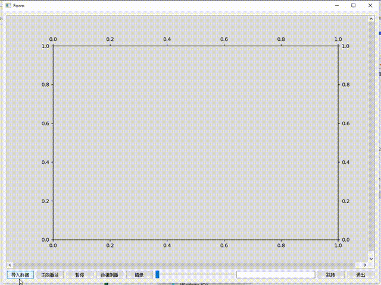

# 使用演示

#### 使用演示

#### 介绍

一个简单的实时动态绘图软件，利用pyqt+plt完成。
这个项目是自己给别人做的需求的简化版本，主要用于动态性的展示数据的变化趋势，支持跳转定位、倒播、数据镜像等功能。

#### 软件架构
软件架构说明

#### 安装须知

你可能需要配置的环境：pyqt5、matplotlib、pandas、numpy
你可以使用以下命令尝试安装：
pip3 install pyqt5 matplotlib pandas numpy

#### 使用说明

1.  运行main.py即可

#### 参与贡献

1.  Fork 本仓库
2.  新建 Feat_xxx 分支
3.  提交代码
4.  新建 Pull Request

